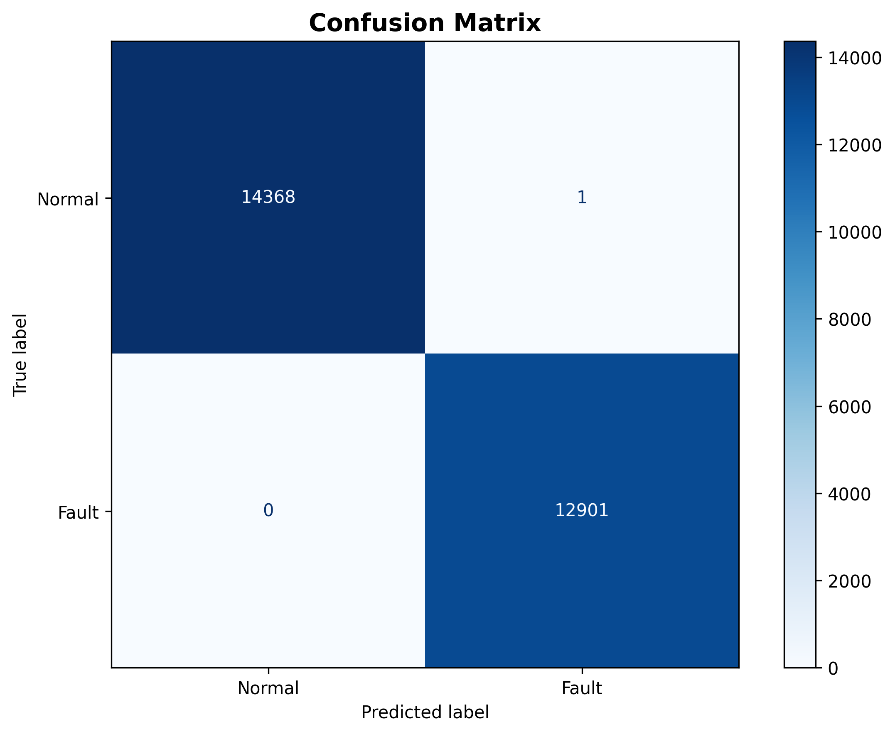
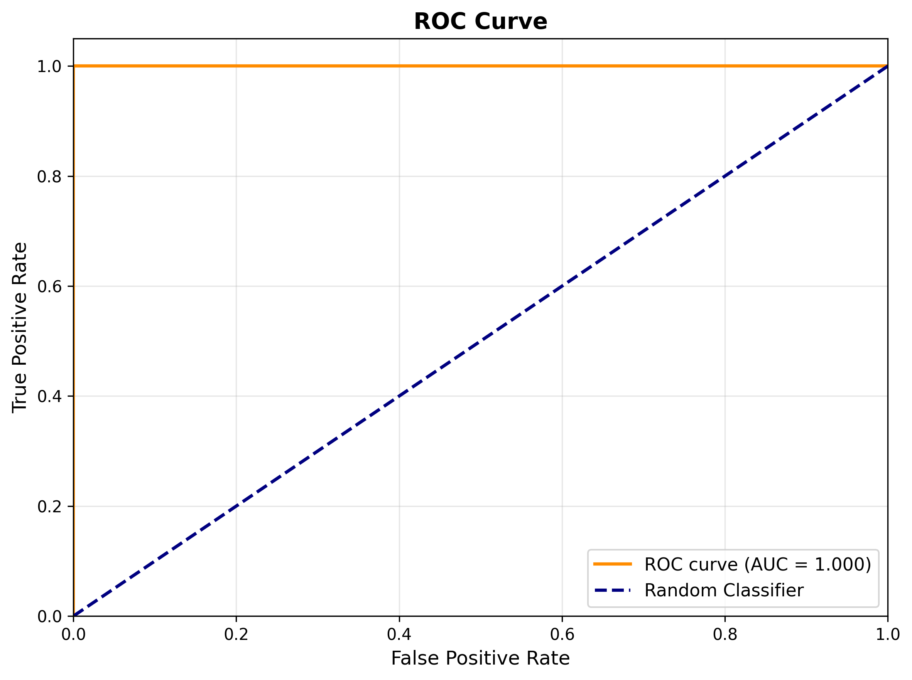
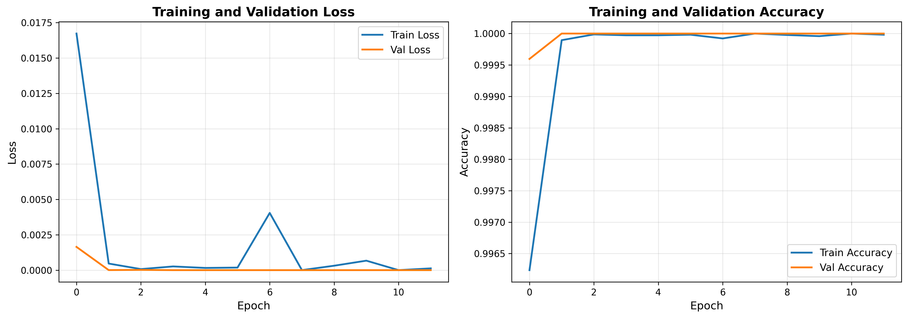

<div align="center">

# 📡 Transformer-Realtime-Monitoring

### Transformer-based real-time PV fault monitoring.

Time-series fault classification at 96.8% accuracy — millisecond inference, edge / cloud deployable.

[](LICENSE)
[](https://www.python.org/)
[](https://pytorch.org/)

</div>

---

**Transformer-Realtime-Monitoring** classifies **photovoltaic module faults** with a **Transformer** model over time-series data — reaching **96.8% accuracy** (F1 97.2%, ROC AUC 0.99) with **millisecond-level** inference, deployable at edge or cloud.

> [!NOTE]
> 中文项目：基于 Transformer 的光伏模块故障实时监测——时序分类，准确率 96.8%，毫秒级推理，边缘/云端部署。

---

## Features

- **Transformer classifier** — time-series fault diagnosis.
- **High accuracy** — 96.8% accuracy, F1 97.2%, ROC AUC 0.99.
- **Real-time** — millisecond inference.
- **Flexible deployment** — edge or cloud.
- **Transferable** — applicable to wind, grid and industrial monitoring.

---

## Quickstart

```bash
git clone https://github.com/Windyhhh/Transformer-Realtime-Monitoring.git
cd Transformer-Realtime-Monitoring

pip install -r requirements.txt

python pv_fault_diagnosis/main.py    # train / diagnose
python pv_fault_diagnosis/inference.py  # real-time inference
```

A trained model (`best_model.pth`) is included.

---

## Project Structure

```
Transformer-Realtime-Monitoring/
├── pv_fault_diagnosis/
│   ├── main.py, model.py, inference.py, evaluate.py
│   ├── data_preprocessing.py
│   ├── models/            # best_model.pth, scaler.pkl
│   └── logs/
├── F0L.xlsx / F1L.xlsx    # data
└── README.md
```

---


## Results

<div align="center">
  
  
  
</div>

---
## License

MIT — free to use, modify and distribute.
